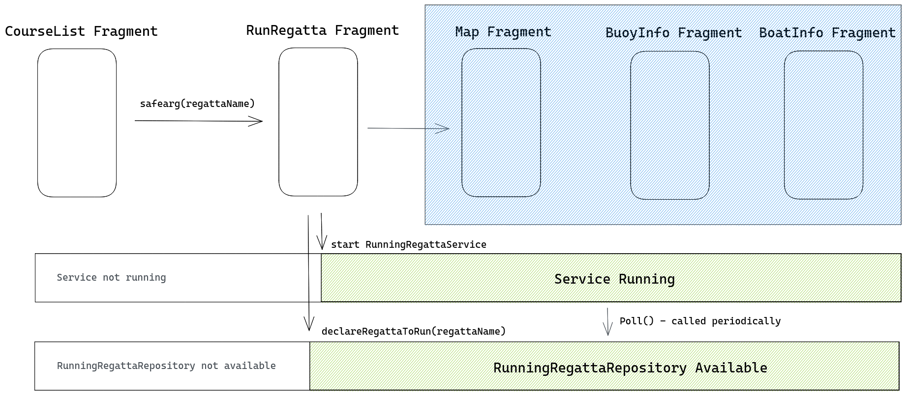

# Repository

Premessa: Se non sono chiari, i concetti di Repository e di Data layer sono spiegati prevemente nella [documentazione sull'architettura](https://developer.android.com/topic/architecture#recommended-app-arch) di Android.

In poche parole comunque, il data layer è la parte dell'applicazione che gestisce la logica e i dati dell'applicazione.

Tutte le interazioni con il data layer dell'applicazione avvengono tramite queste tre repository

## AuthRepository

Serve a gestire login, logout, ottenere i dati sull'utente loggato come ad esempio nome, e se è race officer.
Questi dati sono molto utili, ad esempio alcuni pulsanti dell'app si possono disattivare se l'utente non è
un race officer.

[TODO: link a docs authrepository]

## RegattaRepository

Questa repository serve a gestire le regate:
Contiene i metodi per modificare una regata, creare una regata, o eliminare una regata.

[TODO: link a docs regattarepository]

## RunningRegattaRepository

Questta repository serve a gestire la regata in corso al momento, e permette di ottenere
la lista di boe, roboe, barche, e altre info su questa regata.

è una repository particolare, perchè può essere usata solamente all'interno delle schermate associate ad una "regata in corso":

- MapFragment
- BuoyInfoFragment
- BoatInfoFragment
- RoboaInfoFragment

Nota che il concetto di "regata in corso"
All'interno del codice è tradotto come "running regatta".

[TODO: link a docs runningregattarepository]

la documentazione di questa repository include una spiegazione del suo comportamento particolare

[TODO: move to runningregattarepository doc]

Questa repository è complicata perchè quando si "lancia" una regatta, Occorre fare due cose:
- Salvare in memoria il nome della regata lanciata
- Attivare il foreground service che si occupa di tenere aggiornati i dati, anche quando si spegne lo schermo.

Tutto questo è fatto dal fragment RunRegattaFragment, secondo questo schema

